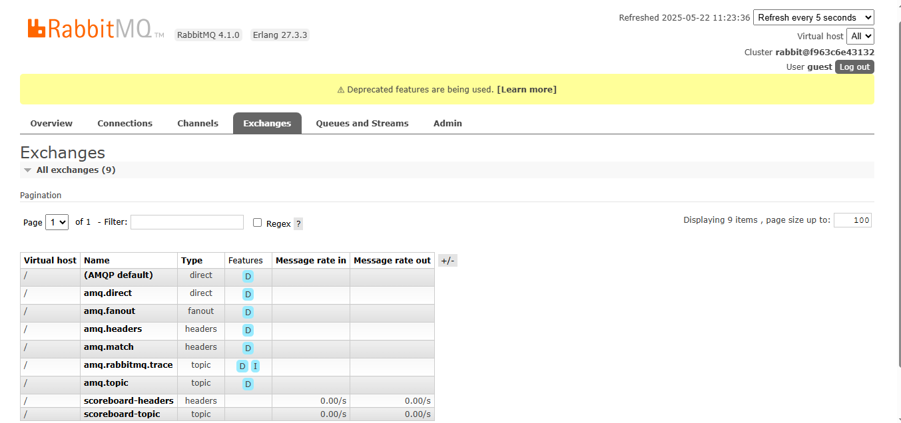

# Rabbit MQ Development Overview using NodeJs

## Pre-requisites
- Basic knowledge of dockers.
- Basic knowledge of Nodejs.
- Basic knowledge of RabbitMQ.

## Setup and Installation
- Install Docker on your local system
   - [Windows](https://docs.docker.com/desktop/setup/install/windows-install/)
   - [Linux](https://docs.docker.com/engine/install/ubuntu/)
   - [MacOS](https://docs.docker.com/desktop/setup/install/mac-install/)
- Feel free to use any code editor, I am using [VS Code](https://docs.docker.com/desktop/setup/install/mac-install/) for this repo.
- Install [Node and Npm](https://docs.npmjs.com/downloading-and-installing-node-js-and-npm/)
- Pull the latest image for RabbitMQ
```
docker pull rabbitmq:management
``` 
- Run local RabbitMQ server
```
docker run -d --name rabbitmq -p 5672:5672 -p 15672:15672 rabbitmq:management
```
> RabbitMQ by default runs on port 5672 and its dashboard runs on 15672.

- Verify if the docker is running correctly by visiting the site `http://localhost:15672/#/`.
  - The credentials for local development is `guest` for both username and password.
  - The UI should look like image in next section.

## RabbitMQ Dashboard
You can checkout the RabbitMQ Dashboard at `http://localhost:15672/#/`


## Exchange Types
### Direct

### Fanout

### Header

### Topic
